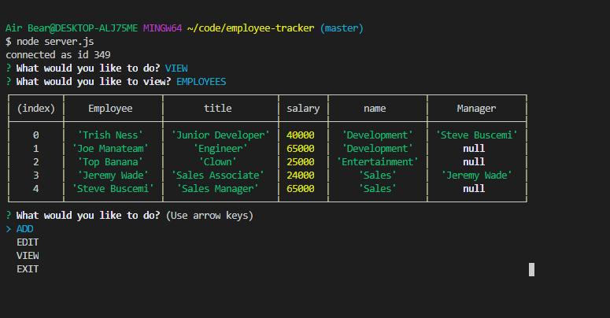

# Unit 12 MySQL Homework: Employee Tracker [](http://unlicense.org/) 

## Description
    This is a command line application used for reading the employee_db. You can add data, update data, and read data. Eventually you will be able to delete data.


  
  ## Table of Contents
  1. [User Story](#UserStory)
  2. [Installation](#Installation)
  3. [Usage](#Usage)
  4. [Tests](#Tests)
  5. [GitHub Links](#GitHubLinks)


  ## UserStory
  ```
  As a business owner
  I want to be able to view and manage the departments, roles, and employees in my company
  So that I can organize and plan my business
  ```

  ## Installation
  
    Clone the repo off of GitHub. npm install inquirer. npm install mysql. Add the schema and the seeds to MySQL.

  
  ## Usage
  [How to use Video](https://drive.google.com/file/d/1moc4wEEIvuWe20EglWkNJMCFWK8WvezA/view)

    You run it from the command line and follow the prompts. Use node index.js.
  
  ## Tests
  
    npm tests. No Tests provided.
   
  ## GitHubLinks
  
  [Git Hub Username](https://www.github.com/CodySamuels)
  
  [The Repo](https://github.com/CodySamuels/employee-tracker)